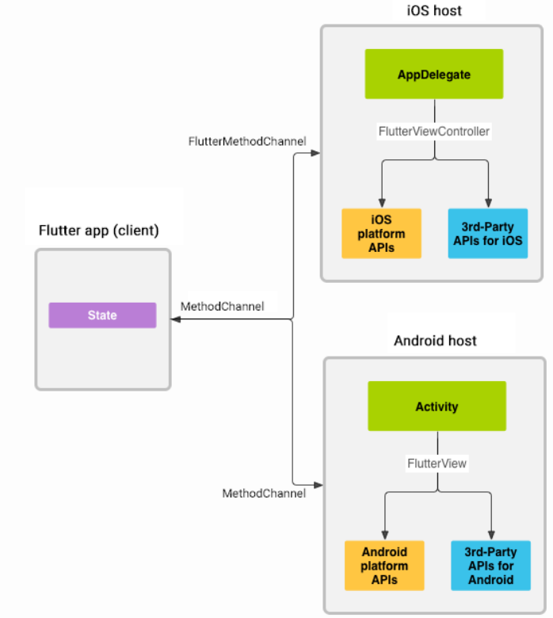
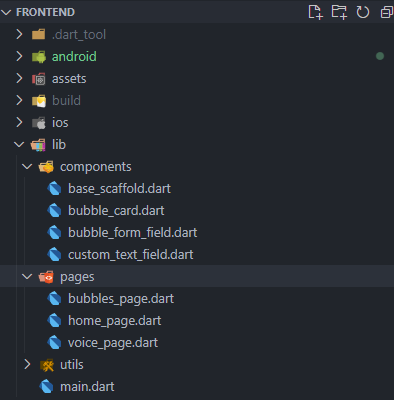
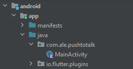
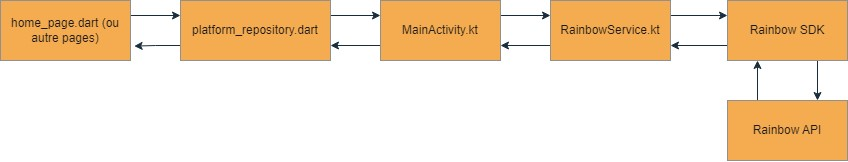

## PushToTalk - Frontend  

Frontend de l'application PTT pour Rainbow (Alcatel-Lucent Enterprise)

## Etat actuel du frontend

- Possibilité de se connecter à l'application avec ses identifiants rainbow
- Possibilité de consulter son profil et se déconnecter
- Possibilité de remplir un formulaire de création de bulle avec ses coordonnées GPS

## Concept

- Associer la localisation d'une personne avec des canaux vocaux
- L'entrée dans une zone géographique déclenchera l'insertion dans un canal
- Technologie de localisation : GPS et Bluetooth

**Nouveauté**
App Wear OS : un QR code à scanner sur la montre permettra de relier l'application mobile et l'app wear os. Elle servira de bouton physique pour le push-to-talk

## Technologies utilisées

> Dart avec le framework Flutter.
> Kotlin nécessaire pour l'utilisation du SDK Rainbow

## Pont de liaison

Afin de permettre la communication entre Flutter/Dart et le SDK Rainbow. Un "pont de liaison" a du être mis en place, d'où l'utilisation de Kotlin.

1. Dart envoie un appel au Kotlin
2. Kotlin communique avec le SDK Rainbow
3. Kotlin renvoie les informations a Dart
4. Dart récupère et met à jour les vues

> Aperçu du fonctionnement du pont de liaison

## Dépendances

> Flutter

    geolocator: 10.1.0
    flutter_blue_plus: 1.29.3

> Kotlin

    rainbowsdk: 2.40.0

## Prérequis

- Java
- [Android Studio](https://developer.android.com/studio). Une fois installé, pensez à télécharger les "Android SDK Command-line Tools" depuis le SDK Manager > SDK Tools d'Android Studio
- Emulateur sous **API 34**, configurable depuis Android Studio dans le Device Manager
- [Flutter](https://docs.flutter.dev/get-started/install/windows), suivre **_scrupuleusement_** la documentation d'installation. Elle contient également des informations utiles sur Android Studio
- [VS Code](https://code.visualstudio.com/download), avec (au moins) les plugins : Dart, Flutter, iOS Emulator (afin d'utiliser votre émulateur dans VS Code)
- Un compte Rainbow développeur avec une [**Application Sandbox**](https://developers.openrainbow.com/sandbox). Sans elle, il vous sera impossible d'initialiser le SDK Rainbow depuis le projet PTT. Pour plus d'informations sur l'obtention d'un compte Rainbow développeur, voir la [documentation officielle](https://developers.openrainbow.com/doc/hub/getting-started)

## Exécution

    git clone https://github.com/PTT-Alcatel/frontend
    cd frontend
    flutter pub get
    // Lancez votre émulateur Android avant de lancer la commande flutter run
    flutter run

## Informations complémentaires

### Développement

Il est recommandé d'utiliser VS Code avec les plugins suscités pour la partie Dart/Flutter (fichiers dans **lib/**)

_Point d'entrée : **main.dart**_

Il est recommandé d'utiliser Android Studio pour la partie Kotlin afin d'avoir une aide syntaxique (fichiers dans **android/**). Pensez d'ailleurs à uniquement ouvrir la partie **android** de l'application dans Android Studio

### Hot Reload

Flutter dispose du hot reload. Pas besoin de rebuild l'application à chaque modification ! Il suffit de sauvegarder les fichiers modifiés.

### Communication Dart - SDK Rainbow

Ce schéma a pour but d'expliquer brièvement et simplement le cheminement d'une requête vers Rainbow rendu possible grâce au pont de liaison (MethodChannel)

## Fichier env

Le frontend utilise un fichier `env` comportant un ApplicationID et un ApplicationSecret. Ces deux éléments correspondent aux informations de votre **Application Sandbox** précédemment créée. Ce fichier se trouve dans : `android/app/src/main/assets/env`. Pensez à le mettre à jour / le créer.

## Liens utiles

[Documentation Flutter](https://docs.flutter.dev/)

[rainbowSdk](https://developers.openrainbow.com/doc/sdk/android/lts/modules/android_sdk/com.ale.rainbowsdk/index.html)

[Platform Channels](https://docs.flutter.dev/platform-integration/platform-channels?tab=android-channel-java-tab) (Pont de liaison)
